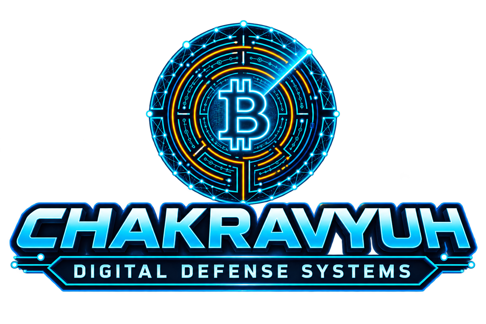

<p align="center">
  
</p>

<h1 align="center">CHAKRAVYUH: Digital Defense Systems</h1>
<h3 align="center">NTRO Forensic C2 & Multi-Hop Blockchain Intelligence Platform</h3>

<p align="center">
  
  
  
  
</p>

---

## 🚀 Overview
**CHAKRAVYUH** is an advanced Command and Control (C2) forensic intelligence platform designed for the **Smart India Hackathon (SIH '26)**. Built specifically for national security and investigative agencies (such as **NTRO**), it tackles the growing threat of sophisticated cryptocurrency laundering, recursive coinjoin mixers (like Wasabi/Samourai), and multi-hop P2P transaction obfuscation.

The platform provides real-time transaction tracing, AI-driven Graph Neural Network (GNN) anomaly detection, air-gapped sentinel node monitoring, and fully auditable XAI decision-tree outputs.

---

## 🛠️ Key Features & Modules

1. **Overview Dashboard**: Real-time high-risk transaction streams, monitored wallet counts, active mixer flags, and live telemetry indicators.
2. **Active Case Dossiers (Investigations)**: Classified multi-hop tracing operations, lead analyst tracking, and suspect node cluster management.
3. **Memgraph Blockchain Relationship Graph**: Interactive topology mapping recursive coinjoin sinks, P2P broker nodes, and target deposit pools with a live graph inspector.
4. **Real-Time Threat Alerts**: Automated heuristic triggers, severity filtering (Critical/High), and automated zero-egress firewall interception logs.
5. **Deep Transaction Analysis**: Raw UTXO input inspection, multi-sig script parsing, and AI-driven risk confidence scoring.
6. **Multi-Hop Timeline Replay**: Chronological reconstruction of cross-chain fund movements and P2P broadcast events.
7. **P2P Node Sentinel Intelligence**: Air-gapped decentralized gateway listener status and network latency tracking across global nodes.
8. **AI Intelligence Core**: Deep learning GNN v4.2 heuristic evaluation and active neural weight tracking.
9. **AI Explainability & XAI Audit Engine**: SHAP/LIME-compliant decision-tree feature weight breakdowns for judicial transparency.
10. **Human-in-the-Loop Analyst Feedback Loop**: Ground-truth validation mechanisms to retrain GNN heuristic weights.
11. **Air-Gapped Enclave Controls**: Zero-egress firewall rule enforcement and secure Memgraph database synchronization.

---

## ⚙️ Tech Stack

* **Frontend**: React, TypeScript, Vite, Tailwind CSS v4, React Router DOM, Lucide Icons
* **Database & Graph Engine**: Memgraph (In-Memory Graph Database for sub-graph querying)
* **AI & Heuristics**: Graph Neural Networks (GNN v4.2), SHAP/LIME Explainability Frameworks
* **Security**: Zero-Egress Air-Gapped Enclave Architecture

---

## 📦 Installation & Local Setup

1. **Clone the Repository**:
   ```bash
   git clone [https://github.com/devchahar01/SIH26.git](https://github.com/devchahar01/SIH26.git)
   cd SIH26